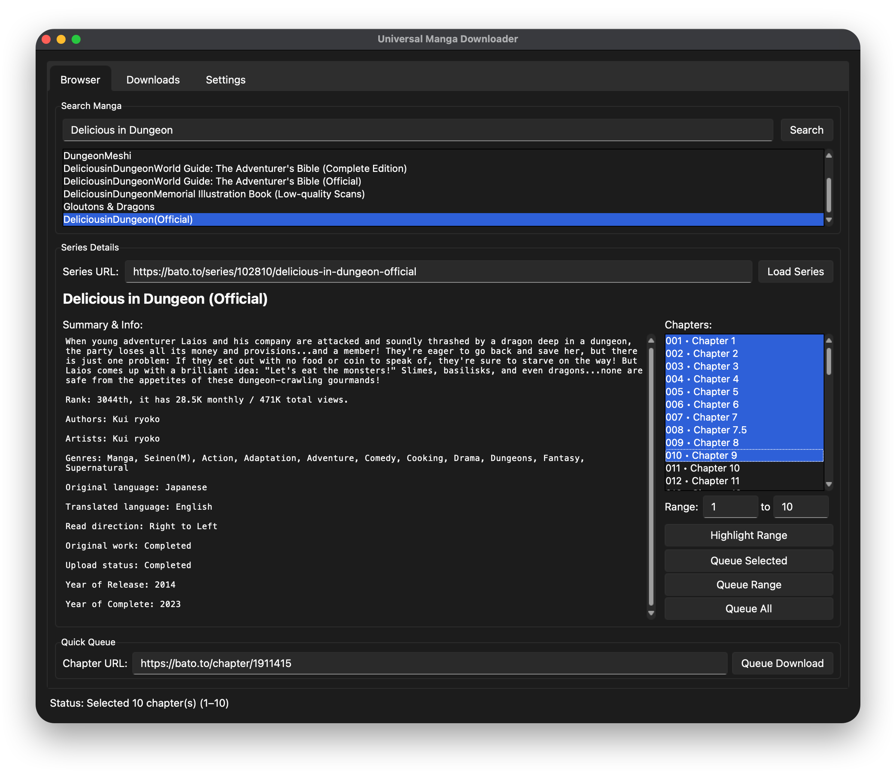
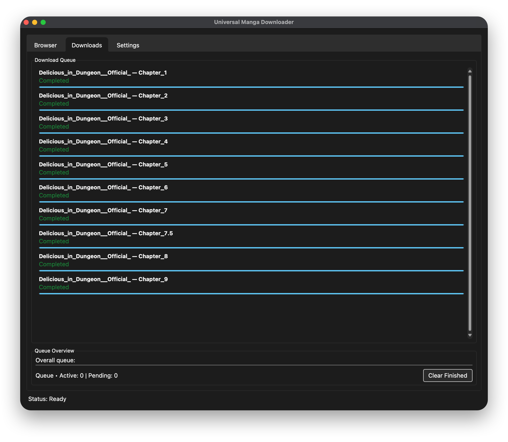
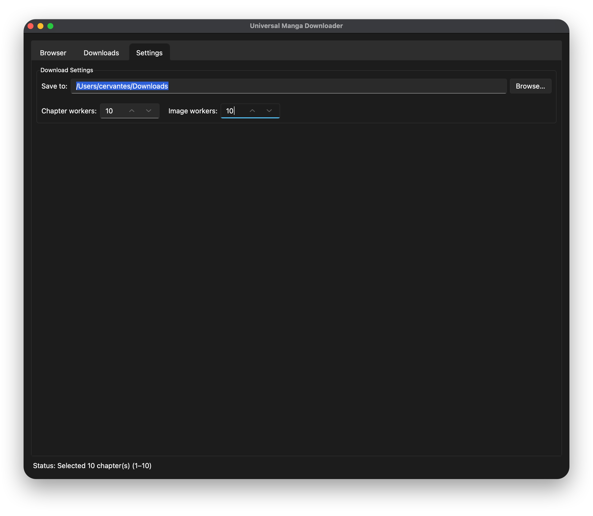

# Universal Manga Downloader

An extensible, user-friendly GUI tool to download manga chapters from various websites and automatically convert them into rich digital archives.

This tool is built on a **modular plugin engine**, making it adaptable to future website changes and expandable to support new sites or output formats without touching the core codebase.

---

## A Brand New Tabbed Interface

Version 1.0 introduces a tabbed workspace that cleanly separates searching, monitoring your download queue, and configuration.

### Browser
The Browser tab is where you can search for manga, review series info, and easily select chapters for download.

### Downloads
A live queue dashboard! Every queued chapter gets its own status line and progress bar so you can watch fetching, downloading, and conversion stages in real time.

### Settings
The download directory, chapter workers, and image workers live together under the Settings tab for quick tweaks.

---

## Key Features

-   ✅ **Plugin System**: Automatically discovers parser and converter plugins, so contributors can add new sites or formats by dropping a file into the `plugins/` directory.
-   ✅ **Zero-Setup Installation**: Automatically installs all required libraries on first run.
-   ✅ **Tabbed UI**: Navigate between `Browser`, `Downloads`, and `Settings` tabs to keep searching, monitoring, and configuring separate and tidy.
-   ✅ **Batch Queue & Range Control**: Queue entire series, highlight ranges with one click, press `Ctrl+A` to select everything, or fine-tune chapter spans via the new range helpers.
-   ✅ **Per-Chapter Progress**: Watch each chapter advance from fetch to PDF conversion with a dedicated queue entry and live status updates.
-   ✅ **Multi-Threaded Downloads**: Adjust chapter and image worker counts to shorten download times on fast connections.
-   ✅ **Custom Download Folder**: Save chapters anywhere—no more being locked to your system Downloads directory.
-   ✅ **Bato.to Search & Chapter Explorer**: Search the catalog, review series info, and select chapters to pre-fill the downloader with a single click.
-   ✅ **Plugin Output Formats**: Ships with PDF and CBZ converters and makes it trivial to ship your own (EPUB, plain images, etc.).
-   ✅ **Smart Folder Organization**: Creates folders named after the manga title and chapter.
-   ✅ **Advanced Web Scraping**: Uses `cloudscraper` to bypass anti-bot protections like Cloudflare.
-   ✅ **Cross-Platform Support**: Works flawlessly on Windows, macOS, and Linux.

---

## Before You Start: The Only Prerequisite

The **only** thing you need is **Python 3**.

#### How to check if Python 3 is installed?

Open your "Terminal" or "Command Prompt" and type `python3 --version` (or `python --version`). If you see a version number, you're ready. If not, download it from the [official Python website](https://www.python.org/downloads/), ensuring you check **"Add Python to PATH"** during installation.

---

## How to Use: Quick Start in 3 Steps

#### Step 1: Download The Tool
1.  Go to the project's GitHub page.
2.  Click the green **`< > Code`** button -> **`Download ZIP`**.
3.  Unzip the downloaded file.

#### Step 2: Find and Run the Script
1.  Open the unzipped folder.
2.  **Open a terminal in this folder**:
    -   **Windows**: Type `cmd` in the folder's address bar and press Enter.
    -   **macOS**: Right-click the folder's title in the Finder window and choose "New Terminal at Folder".
3.  In the terminal, type `python3 manga_downloader.py` and press Enter.

#### Step 3: Copy, Paste, and Download
1.  The GUI window will appear. (It may pause on first run to auto-install libraries).
2.  In the **Browser** tab, type a title into **Search Manga** and press `Enter`, or double-click a result to load its synopsis and chapter list automatically.
3.  Multi-select chapters with Shift/Ctrl, press **Highlight Range** to preselect a span, or paste a chapter URL into **Quick Queue**—then choose **Queue Selected**, **Queue Range**, **Queue All**, or **Queue Download** to add them to the queue.
4.  Switch to the **Downloads** tab to watch each chapter's progress, and use the **Settings** tab to adjust the download folder or worker counts whenever you need.

---

## For Developers: Extend with Plugins

See `DEVELOPMENT.md` for environment setup, linting, and type-checking instructions before contributing changes.

Universal Manga Downloader 1.3.0 introduces a dedicated plugin system. You can now add new site parsers or export formats without editing `manga_downloader.py`.

### Adding a Parser Plugin

1.  Create a new file inside `plugins/` (for example, `my_site.py`).
2.  Subclass `BasePlugin` from `plugins.base`.
3.  Implement the required methods:
    -   `get_name(self) -> str`
    -   `can_handle(self, url: str) -> bool`
    -   `parse(self, soup: BeautifulSoup, url: str) -> ParsedChapter | None`
4.  (Optional) Override `on_load`/`on_unload` for setup or cleanup work.
5.  Save the file—no manual registration needed. The manager loads every plugin at startup.

### Adding a Converter Plugin

1.  Create a file in `plugins/` (for example, `epub_converter.py`).
2.  Subclass `BaseConverter` and implement:
    -   `get_name(self) -> str`
    -   `get_output_extension(self) -> str`
    -   `convert(self, image_files, output_dir, metadata)` returning the created file path.
3.  Use the supplied `ChapterMetadata` to populate filenames or metadata.
4.  Respect the project's non-commercial license—plugins must not include monetization or tracking code.

Once enabled from the Settings tab, your plugin will appear in the GUI and participate in downloads automatically.

### Future Extensions

-   Explore exposing plugin entry points so third-party packages installed via `pip` can register automatically.

---

## Troubleshooting

-   **"No suitable parser found"**: This means the URL is from a website or a page layout that is not yet supported.
-   **Window flashes and disappears**: Check the terminal for error messages.
-   **Download fails**: Check your internet connection and the URL.

## License

This project is licensed under the [Creative Commons Attribution-NonCommercial-ShareAlike 4.0 International License](https://creativecommons.org/licenses/by-nc-sa/4.0/).

In short, you are free to:
-   **Share** — copy and redistribute the material in any medium or format.
-   **Adapt** — remix, transform, and build upon the material.

Under the following terms:
-   **Attribution** — You must give appropriate credit.
-   **NonCommercial** — You may not use the material for commercial purposes.
-   **ShareAlike** — If you remix, transform, or build upon the material, you must distribute your contributions under the same license as the original.
